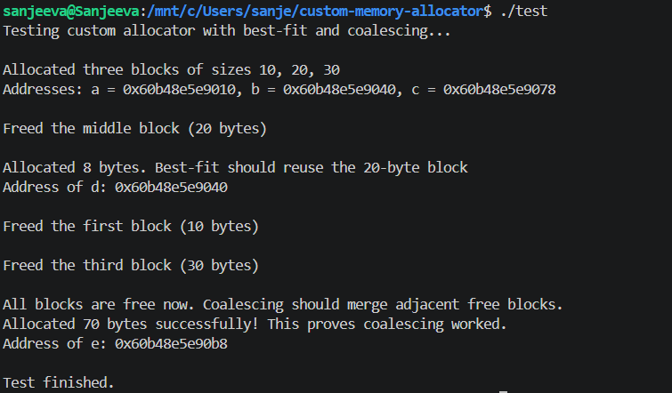
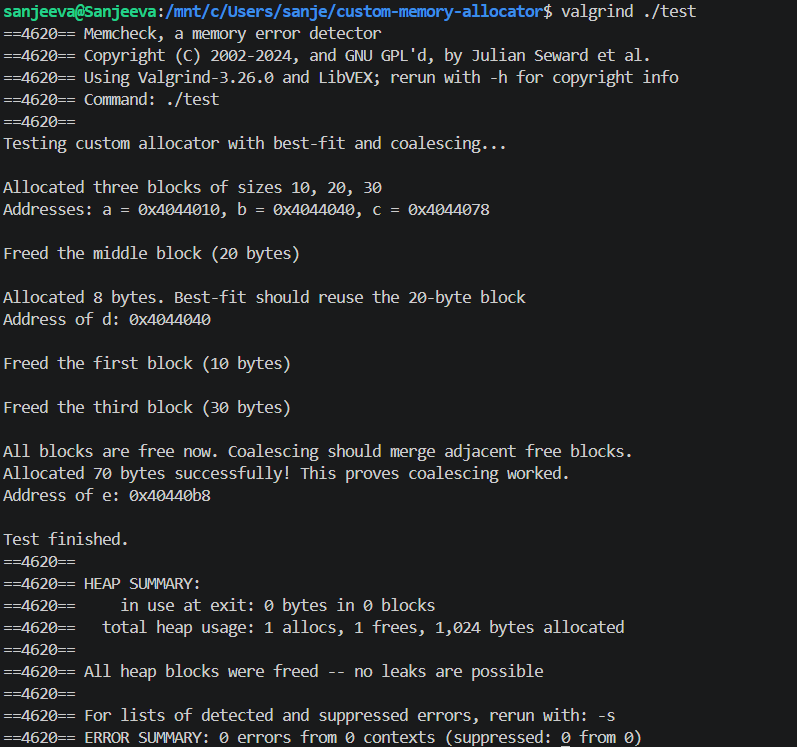

# Custom Memory Allocator in C
## Best-Fit Heap Allocator with Boundary Tags, Block Splitting and Coalescing

A custom implementation of `malloc` and `free` written in C from scratch. The allocator uses the `sbrk` system call to manage the heap directly, with an implicit free list, boundary tags (header + footer), best-fit allocation strategy, block splitting, and coalescing.

---

## Project Structure

```
custom-memory-allocator/
├── allocator.h          # Header file with struct and function prototypes
├── allocator.c          # Main implementation (my_malloc, my_free, helpers)
├── test.c               # Test program demonstrating all features
├── test_output.png      # Screenshot of test execution
├── valgrind_output.png  # Screenshot of valgrind output
└── README.md            # This file
```

---

## Quick Start

```bash
gcc -Wall -o test test.c allocator.c
./test
```

This project was developed and tested on Ubuntu running under WSL2, but it should also build on Linux systems with a C compiler such as gcc.

---

## How It Works

### 1. Heap Management Using `sbrk`

The allocator requests additional heap memory directly from the operating system using `sbrk`. Newly allocated regions are initialized with both a header and footer before being inserted into the implicit free list.

```c
block_meta *request_memory(size_t size) {
    void *old_brk = sbrk(0);
    block_meta *new_block = sbrk(size);
    ...
}
```

---

### 2. Memory Blocks with Boundary Tags

Every block of memory has a header and a footer. Each header/footer stores:

- `size` – total size of the block (including header, data, and footer)
- `is_free` – 1 if the block is free, 0 if allocated

```
┌─────────────────────┐
│  Header (block_meta) │  ← size, is_free
├─────────────────────┤
│  User Data           │  ← What the user requested
├─────────────────────┤
│  Footer (block_meta) │  ← size, is_free (same as header)
└─────────────────────┘
```

The footer stores metadata that enables identification of adjacent blocks during coalescing.

Implementation:

```c
typedef struct block_meta {
    size_t size;
    int is_free;
} block_meta;
```

---

### 3. Best-Fit Search Strategy

The allocator scans the entire implicit free list and selects the smallest free block that can satisfy the request. This minimizes internal fragmentation compared to first-fit or next-fit strategies.

```c
block_meta *find_free_block(size_t size) {
    block_meta *curr = head;
    block_meta *best = NULL;
    size_t smallest_diff = ~0;
    while (curr != NULL && (char *)curr < (char *)heap_end) {
        if (curr->is_free == 1 && curr->size >= size) {
            if (curr->size - size < smallest_diff) {
                smallest_diff = curr->size - size;
                best = curr;
                if (smallest_diff == 0) break; // exact match
            }
        }
        curr = (block_meta *)((char *)curr + curr->size);
    }
    return best;
}
```

The following execution demonstrates that after freeing the 20-byte block, a subsequent 8-byte allocation reuses the same address, confirming the best-fit search selected the smallest suitable free block.

---

### 4. Block Splitting

When a free block is significantly larger than the requested allocation, the allocator splits it into two blocks:

- One allocated block of the requested size
- One free block containing the remaining memory

This reduces internal fragmentation and improves future allocation efficiency.

```c
if (block->size >= total_block_size + BLOCK_META_SIZE + 8) {
    block_meta *new_free = (block_meta *)((char *)block + total_block_size);
    size_t remaining = block->size - total_block_size;
    ...
}
```

---

### 5. Block Coalescing

When a block is freed, the allocator checks whether the blocks immediately before and after it are also free. If they are, it merges them into a single larger free block. This helps reduce external fragmentation.

```c
// Merge with next block if it is free
block_meta *next_block = (block_meta *)((char *)block + block->size);
if ((char *)next_block < (char *)heap_end && next_block->is_free == 1) {
    size_t new_size = block->size + next_block->size;
    block->size = new_size;
    ...
}

// Merge with previous block if it is free
block_meta *curr = head;
block_meta *prev_block = NULL;
while (curr != NULL && (char *)curr < (char *)heap_end) {
    if ((char *)((char *)curr + curr->size) == (char *)block) {
        prev_block = curr;
        break;
    }
    curr = (block_meta *)((char *)curr + curr->size);
}

if (prev_block != NULL && prev_block->is_free == 1) {
    size_t new_size = prev_block->size + block->size;
    prev_block->size = new_size;
    ...
}
```

The following execution demonstrates that after freeing all three blocks (10, 20, 30), the allocator successfully fulfills a 70-byte request. This confirms that coalescing merged the adjacent free blocks into one large block.

---

### 6. Memory Alignment

All allocations are aligned to 8-byte boundaries to satisfy common alignment requirements for modern processors and to ensure proper alignment for all data types.

```c
size_t align_size(size_t size) {
    return (size + 7) & ~7;
}
```

---

## Complexity

| Operation | Complexity |
|---|---|
| `my_malloc` | O(n) |
| `my_free` | O(n) |
| Alignment | O(1) |

---

## Sample Execution



The output above shows:

- Address `d` reuses the address of the freed 20-byte block → best-fit works
- 70-byte allocation succeeds after freeing all three blocks → coalescing works

---

## Valgrind Verification



```
==2532== HEAP SUMMARY:
==2532==     in use at exit: 0 bytes in 0 blocks
==2532==   total heap usage: 1 allocs, 1 frees, 1,024 bytes allocated
==2532== 
==2532== All heap blocks were freed -- no leaks are possible
==2532== 
==2532== ERROR SUMMARY: 0 errors from 0 contexts (suppressed: 0 from 0)
```

Valgrind reports no memory leaks and no invalid memory accesses during the test execution.

---

# Why This Matters

Understanding how memory allocators work is fundamental to systems programming. This project demonstrates:

- Direct interaction with the operating system (sbrk)
- Low-level memory management
- Efficient algorithms (best-fit, coalescing)
- Thread-safety considerations (the design can be extended with locks)

---
